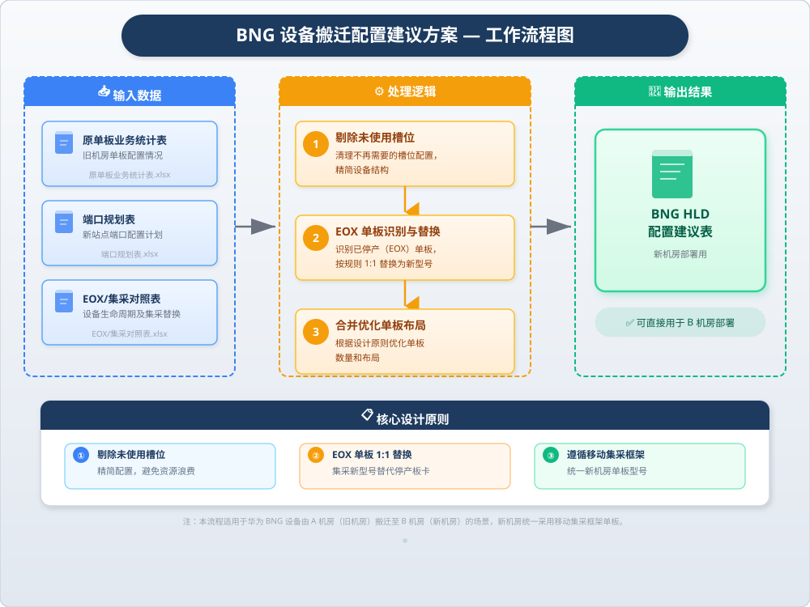
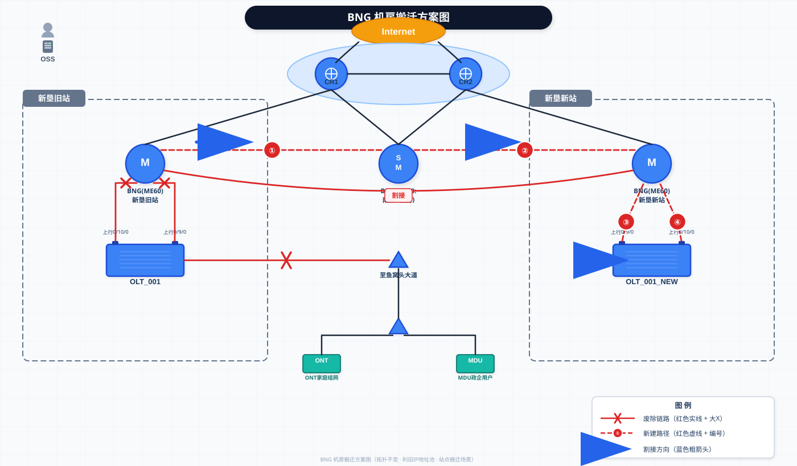

# 新垦机房BNG搬迁方案

> **场景类型：** 拓扑不变，利旧IP地址池，站点搬迁  
> **割接方式：** BNG一次性割接  
> **下挂OLT数量：** 22台（20-30范围，适用单次割接场景）  
> **文档版本：** v1.0  
> **编制日期：** 2025年  

---

## 一、项目背景

本项目为**新垦机房BNG设备（ME60-X16）整体搬迁**工程。因新垦旧机房（站点B）退网，需将现网BNG设备从旧机房搬迁至新垦新机房（站点C），搬迁过程中保持网络拓扑不变、用户IP地址池利旧，下挂22台OLT一次性整体割接。

### 1.1 涉及设备

| 设备名称 | 设备型号 | 机房位置 | 角色 |
| --- | --- | --- | --- |
| BNG-ME60-01 | ME60-X16 | 新垦旧站（站点B） | 现网BNG，待搬迁 |
| BNG-ME60-01（新） | ME60-X16 | 新垦新站（站点C） | 目标BNG，搬迁后承载 |
| CR | — | 新垦新站 | 核心路由器，CMNET上联 |

### 1.2 设备配置概况

- **机框型号：** ME60-X16（16槽位机框）
- **在用槽位：** 11个（Slot 0-4, 7, 8, 10, 11, 12, 15）
- **未用槽位：** 5个（Slot 5, 6, 9, 13, 14）
- **主控板：** Slot 0/1 — CR52-MPUB（⚠️ EOX，需替换）
- **交换网板：** Slot 2/3/4 — CR52-SFUB（Slot 2/3 EOX）
- **业务板：** Slot 7/8/15 — CR52-E8GF（⚠️ EOX）；Slot 10/11 — CR52-E24GF（⚠️ EOX）；Slot 12 — CR52-E12GF（正常）

### 1.3 下挂OLT汇总

| 统计项 | 数量/详情 |
| --- | --- |
| OLT总数 | 22台 |
| PPPoE用户OLT | 14台（含2台PPPoE+IPTV混合） |
| DHCP用户OLT | 3台（含1台DHCP+IPTV混合） |
| 专线+静态用户OLT | 2台 |
| 覆盖用户总数 | ~21,600户 |
| VLAN范围 | 1001-3100 |

---

## 二、现网说明

### 2.1 网络现状

- 现网BNG-ME60-01部署于新垦旧站（站点B），通过上联端口连接CMNET核心路由器（CR）。
- 下挂22台OLT，通过GE光口上联至BNG，覆盖PPPoE拨号、DHCP、IPTV、专线及静态IP等多种业务。
- 现网为**双机冷备**架构：BNG1主用 + BNG2备用，本次搬迁BNG1设备。

### 2.2 搬迁策略

- **站点B → 站点C搬迁：** 设备从旧机房物理搬迁至新机房，网络拓扑关系不变。
- **设备循环使用：** 旧机房BNG设备搬迁后在新机房重新上线，原有机框及可用单板继续使用，EOX单板替换为集采新型号。
- **IP地址池利旧：** PPPoE用户、DHCP用户沿用原有地址池配置；专线用户和静态IP用户使用利旧IP，不做变更。

### 2.3 搬迁拓扑关系

> **割接路径说明：**  
> ① 新机房BNG上架、加电、对接CMNET CR  
> ② 新建BNG对接认证/计费系统，完成冷备配置  
> ③ OLT上联链路从旧BNG逐条切换至新BNG  
> ④ 验证业务正常后，拆除旧BNG设备

---

## 三、客户依赖

以下事项需要客户侧协调配合，请在割接前确认并落实责任人：

| 序号 | 依赖事项 | 责任方 | 说明 | 建议完成时间 |
| --- | --- | --- | --- | --- |
| 1 | **计费认证/DHCP系统对接协调** | 客户运维部门 | 新BNG需与现网RADIUS/AAA计费认证系统对接，DHCP Server需放通新BNG的relay地址。需客户协调计费厂家配合配置。 | 割接前7天 |
| 2 | **大企业/专线用户割接配合测试** | 客户政企部门 | OLT-BJ-DX-09、OLT-BJ-DX-10下挂专线+静态用户共380户，需提前通知客户割接窗口，并在割接后配合进行端到端业务验证。 | 割接前3天通知 |
| 3 | **分次割接时新建地址段提供（如需）** | 客户IP地址管理部门 | 若PPPoE/DHCP用户需分批割接并新建地址池，需客户提前提供新IP地址段。本次为一次性割接且利旧IP，此项暂不涉及。 | — |
| 4 | **机房资源确认** | 客户机房管理 | 确认新垦新站机柜空间、电源（直流-48V）、空调、光纤ODF资源满足BNG设备上架要求。 | 割接前14天 |
| 5 | **传输链路确认** | 客户传输部门 | 确认新机房至22台OLT所在机房的传输链路已布放完成，光功率预算满足要求。 | 割接前7天 |

---

## 四、割接关键步骤

### 步骤一：新机房BNG设备上电与CMNET对接

| 项目 | 说明 |
| --- | --- |
| **操作内容** | 1. 新垦新站完成ME60-X16机框安装、单板插装（11个在用槽位单板按配置表就位） 2. 加电启动，检查单板注册状态、电源模块、风扇模块运行正常 3. 上联端口对接CMNET CR，配置IS-IS/OSPF路由协议，注入现网路由 4. 验证与CR的链路连通性及路由收敛 |
| **预计耗时** | 4小时 |
| **操作窗口** | 非业务高峰期（建议凌晨0:00-4:00） |
| **风险点** | ⚠️ **EOX单板替换风险：** 主控板MPUB、交换网板SFUB及多块业务板为EOX状态，集采替代型号需提前确认到位 ⚠️ **华为硬件/license评估：** 新单板是否需单独采购license，需提前向华为确认 |
| **回退方案** | 若新设备无法正常启动，回退至原计划窗口延期，旧BNG继续保持运行 |

### 步骤二：新建BNG对接认证计费系统，完成冷备配置

| 项目 | 说明 |
| --- | --- |
| **操作内容** | 1. 配置RADIUS/AAA认证组，对接现网计费认证系统 2. 配置DHCP Relay，指向现网DHCP Server 3. 同步现网BNG的用户配置：地址池、域名、认证策略、QoS模板等 4. 完成与BNG2之间的冷备协议配置（VRRP/双机热备） 5. 在测试OLT上进行单用户拨测验证 |
| **预计耗时** | 6小时 |
| **操作窗口** | 割接窗口内 |
| **风险点** | ⚠️ **客户协调依赖：** 需计费厂家配合RADIUS NAS-IP白名单添加 ⚠️ **现场测试验证：** 需客户安排测试账号进行端到端认证及业务验证 |
| **回退方案** | 若认证对接失败，暂停割接，保留旧BNG继续承载业务，排查认证侧配置 |

### 步骤三：OLT上联链路切换与用户迁移

| 项目 | 说明 |
| --- | --- |
| **操作内容** | 1. 按OLT清单逐台将上联链路从旧BNG切换至新BNG &nbsp;&nbsp;&nbsp;&nbsp;• 第1-6台：PPPoE用户OLT（OLT-BJ-DX-01 ~ 04, 07, 08） &nbsp;&nbsp;&nbsp;&nbsp;• 第7-9台：DHCP用户OLT（OLT-BJ-DX-05, 06, 14） &nbsp;&nbsp;&nbsp;&nbsp;• 第10-11台：专线+静态OLT（OLT-BJ-DX-09, 10） &nbsp;&nbsp;&nbsp;&nbsp;• 第12-22台：剩余PPPoE/DHCP OLT 2. 切换时先关闭旧BNG侧端口，再开启新BNG侧端口 3. 每切换一台OLT后验证用户上线及业务正常 4. 全部切换完成后整体业务验证 |
| **预计耗时** | 8小时 |
| **操作窗口** | 割接当晚（建议22:00-次日06:00） |
| **风险点** | ⚠️ **路由控制：** 切换过程中需确保路由正确收敛，避免流量黑洞 ⚠️ **多业务受损：** PPPoE用户需重新拨号上线，DHCP用户需重新获取IP，IPTV组播业务需验证 ⚠️ **专线用户中断感知：** 专线+静态用户对中断敏感，需安排最短切换窗口 |
| **回退方案** | 逐台回退：如某台OLT切换后用户无法上线，立即将该OLT上联切回旧BNG |

### 步骤四：业务验证与旧设备拆除

| 项目 | 说明 |
| --- | --- |
| **操作内容** | 1. 全量业务验证：PPPoE拨测、DHCP获取、IPTV播放、专线Ping测试 2. 告警监控：观察新BNG运行1-2天，确认无异常告警 3. 旧BNG设备断电、拆除单板及机框 4. 旧设备按资产流程退库或循环使用 |
| **预计耗时** | 业务验证2天（含观察期）；设备拆除4小时 |
| **操作窗口** | 割接次日开始验证，拆除工作在确认业务稳定后进行 |
| **风险点** | ⚠️ 拆除前务必确认所有OLT已稳定运行于新BNG ⚠️ 旧设备拆除时注意物理标签，方便后续追踪 |
| **回退方案** | 观察期内若新BNG出现不可恢复故障，可紧急恢复旧BNG供电并切回链路 |

---

## 五、割接时间窗口总览

| 阶段 | 时间窗口 | 主要内容 | 是否中断业务 |
| --- | --- | --- | --- |
| 准备阶段 | D-14 ~ D-1 | 机房确认、传输布放、EOX单板采购、配置准备 | 否 |
| 步骤一 | D日 00:00-04:00 | 新BNG上电、CMNET对接 | 否 |
| 步骤二 | D日 04:00-10:00 | 认证计费对接、冷备配置、测试验证 | 否 |
| 步骤三 | D日 22:00-次日06:00 | OLT上联切换、用户迁移 | **是**（所有用户） |
| 步骤四 | D+1 ~ D+3 | 业务验证、旧设备拆除 | 否 |

---

## 六、回退预案

若割接过程中出现严重问题导致无法继续，执行以下回退：

1. **OLT链路回退：** 将已切换OLT的上联端口逐台切回旧BNG，恢复原拓扑。
2. **路由回退：** 在CR侧恢复原有指向旧BNG的路由策略。
3. **认证回退：** 确认旧BNG的RADIUS认证仍可用（割接期间旧BNG不下电）。
4. **回退决策触发条件：**
   - 超过30%的OLT切换后用户无法正常上线
   - 专线用户中断超过30分钟
   - 新BNG出现硬件故障无法快速恢复

---

## 七、附录

### 附录A：旧机房单板配置（BNG-ME60-01 / 新垦旧站）

| Slot | 单板型号 | 类型 | 端口 | 在用 | EOX |
| --- | --- | --- | --- | --- | --- |
| 0 | CR52-MPUB | 主控板 | — | 是 | ⚠️ |
| 1 | CR52-MPUB | 主控板 | — | 是 | ⚠️ |
| 2 | CR52-SFUB | 交换网板 | — | 是 | ⚠️ |
| 3 | CR52-SFUB | 交换网板 | — | 是 | ⚠️ |
| 4 | CR52-SFUB | 交换网板 | — | 是 | 正常 |
| 5 | CR52-P4CF | 业务板 | 4×OC-3 | 否 | 正常 |
| 6 | CR52-P2CF | 业务板 | 2×OC-12 | 否 | 正常 |
| 7 | CR52-E8GF | 业务板 | 8×GE | 是 | ⚠️ |
| 8 | CR52-E8GF | 业务板 | 8×GE | 是 | ⚠️ |
| 9 | CR52-P4CF | 业务板 | 4×OC-3 | 否 | 正常 |
| 10 | CR52-E24GF | 业务板 | 24×GE | 是 | ⚠️ |
| 11 | CR52-E24GF | 业务板 | 24×GE | 是 | ⚠️ |
| 12 | CR52-E12GF | 业务板 | 12×GE | 是 | 正常 |
| 13 | CR52-E12GF | 业务板 | 12×GE | 否 | 正常 |
| 14 | CR52-P1CF | 业务板 | 1×OC-48 | 否 | 正常 |
| 15 | CR52-E8GF | 业务板 | 8×GE | 是 | ⚠️ |

### 附录B：下挂OLT清单

| 序号 | OLT名称 | IP地址 | 上联端口 | 用户类型 | 用户数 | VLAN范围 |
| --- | --- | --- | --- | --- | --- | --- |
| 1 | OLT-BJ-DX-01 | 10.1.1.1 | GE7/0/0 | PPPoE | 1,200 | 1001-1100 |
| 2 | OLT-BJ-DX-02 | 10.1.1.2 | GE7/0/1 | PPPoE | 980 | 1101-1200 |
| 3 | OLT-BJ-DX-03 | 10.1.1.3 | GE7/0/2 | PPPoE+IPTV | 1,500 | 1201-1300 |
| 4 | OLT-BJ-DX-04 | 10.1.1.4 | GE7/0/3 | PPPoE | 800 | 1301-1400 |
| 5 | OLT-BJ-DX-05 | 10.1.1.5 | GE8/0/0 | DHCP | 1,100 | 1401-1500 |
| 6 | OLT-BJ-DX-06 | 10.1.1.6 | GE8/0/1 | DHCP+IPTV | 1,300 | 1501-1600 |
| 7 | OLT-BJ-DX-07 | 10.1.1.7 | GE8/0/2 | PPPoE | 950 | 1601-1700 |
| 8 | OLT-BJ-DX-08 | 10.1.1.8 | GE8/0/3 | PPPoE | 1,050 | 1701-1800 |
| 9 | OLT-BJ-DX-09 | 10.1.1.9 | GE10/0/0 | 专线+静态 | 200 | 1801-1850 |
| 10 | OLT-BJ-DX-10 | 10.1.1.10 | GE10/0/1 | 专线+静态 | 180 | 1851-1900 |
| 11 | OLT-BJ-DX-11 | 10.1.1.11 | GE10/0/2 | PPPoE | 880 | 1901-2000 |
| 12 | OLT-BJ-DX-12 | 10.1.1.12 | GE10/0/3 | PPPoE | 920 | 2001-2100 |
| 13 | OLT-BJ-DX-13 | 10.1.1.13 | GE11/0/0 | PPPoE | 780 | 2101-2200 |
| 14 | OLT-BJ-DX-14 | 10.1.1.14 | GE11/0/1 | DHCP | 1,150 | 2201-2300 |
| 15 | OLT-BJ-DX-15 | 10.1.1.15 | GE11/0/2 | PPPoE | 1,020 | 2301-2400 |
| 16 | OLT-BJ-DX-16 | 10.1.1.16 | GE11/0/3 | PPPoE | 860 | 2401-2500 |
| 17 | OLT-BJ-DX-17 | 10.1.1.17 | GE12/0/0 | PPPoE+IPTV | 1,400 | 2501-2600 |
| 18 | OLT-BJ-DX-18 | 10.1.1.18 | GE12/0/1 | PPPoE | 750 | 2601-2700 |
| 19 | OLT-BJ-DX-19 | 10.1.1.19 | GE12/0/2 | DHCP | 1,080 | 2701-2800 |
| 20 | OLT-BJ-DX-20 | 10.1.1.20 | GE12/0/3 | PPPoE | 900 | 2801-2900 |
| 21 | OLT-BJ-DX-21 | 10.1.1.21 | GE15/0/0 | PPPoE | 850 | 2901-3000 |
| 22 | OLT-BJ-DX-22 | 10.1.1.22 | GE15/0/1 | PPPoE | 960 | 3001-3100 |

### 附录C：EOX单板风险清单

| Slot | 单板型号 | EOX状态 | 影响 | 建议 |
| --- | --- | --- | --- | --- |
| 0 | CR52-MPUB | EOX | 主控板，更换影响整机 | 提前采购集采替代型号 |
| 1 | CR52-MPUB | EOX | 主控板，更换影响整机 | 提前采购集采替代型号 |
| 2 | CR52-SFUB | EOX | 交换网板 | 提前采购集采替代型号 |
| 3 | CR52-SFUB | EOX | 交换网板 | 提前采购集采替代型号 |
| 7 | CR52-E8GF | EOX | 8×GE业务板 | 提前采购集采替代型号 |
| 8 | CR52-E8GF | EOX | 8×GE业务板 | 提前采购集采替代型号 |
| 10 | CR52-E24GF | EOX | 24×GE业务板 | 提前采购集采替代型号 |
| 11 | CR52-E24GF | EOX | 24×GE业务板 | 提前采购集采替代型号 |
| 15 | CR52-E8GF | EOX | 8×GE业务板 | 提前采购集采替代型号 |

> ⚠️ **注意：** 以上EOX单板的集采替代型号需人工向华为确认后填入，当前内置集采对照表中暂无匹配项。

---

*本方案基于现网数据生成，具体执行细节需结合现场实际情况调整。*
